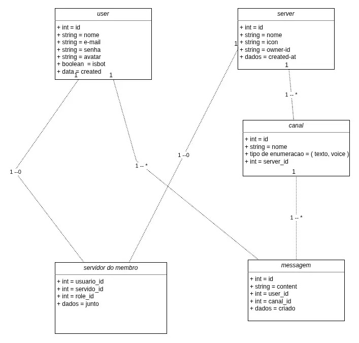

# Discord Clone

This is a Discord clone built using React, Node.js, Express, and Socket.IO. It allows users to create accounts, join servers, and chat with other users in real-time.

> Development in progress

## Architecture



## Getting Started

Uses docker compose to run the application.

```bash
docker compose up
```

This will start the backend server on `http://localhost:3000` and the frontend on `http://localhost:5173`.
