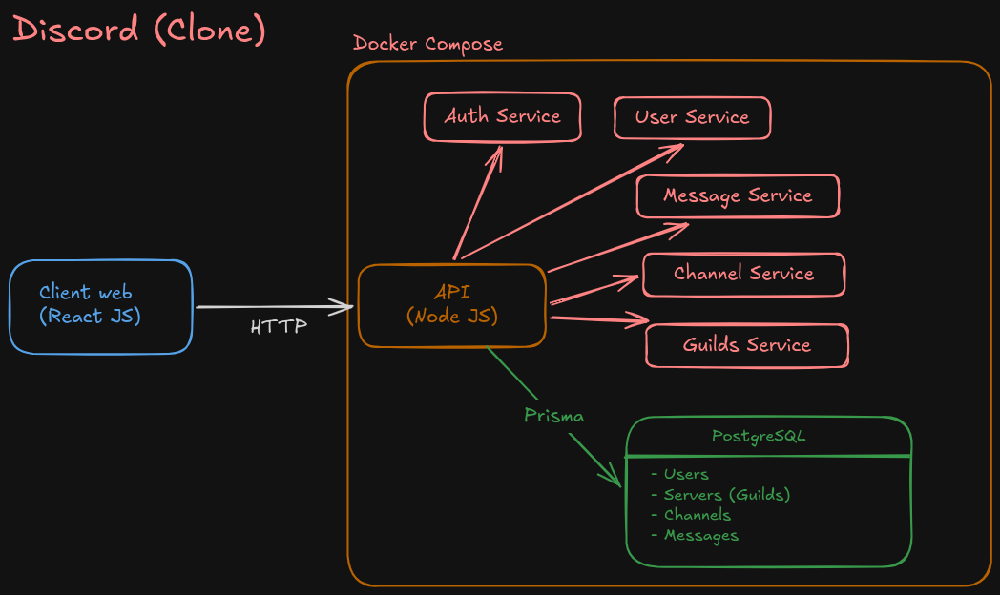
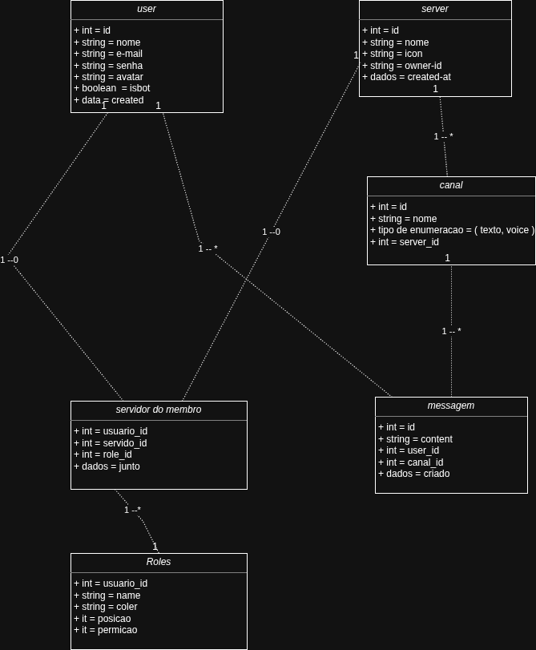

# Discord Clone

## 🏗️ Arquitetura do Sistema

<p align="center">
  
</p>

## 📖 Sobre o Projeto

O Discord Clone é uma aplicação Full Stack inspirada no Discord, desenvolvida com React.js, Node.js, PostgreSQL e Prisma ORM.

O projeto foi criado para praticar conceitos avançados de desenvolvimento web moderno, arquitetura cliente-servidor, APIs REST, modelagem de banco de dados e organização de aplicações escaláveis.

A plataforma permite o gerenciamento de usuários, servidores, canais, cargos e mensagens, simulando funcionalidades encontradas em aplicações reais de comunicação.

---

## 🚀 Tecnologias Utilizadas

### Frontend

- React.js
- Axios
- JavaScript (ES6+)
- HTML5
- CSS3

### Backend

- Node.js
- Express.js
- Prisma ORM

### Banco de Dados

- PostgreSQL

### DevOps

- Docker
- Docker Compose

---
## 🏗️ Arquitetura UML

<p align="center">
  
</p>

## ✨ Funcionalidades

### Usuários

- Criar usuário
- Listar usuários
- Atualizar usuários

### Servidores

- Criar servidores
- Listar servidores
- Atualizar servidores

### Canais

- Criar canais
- Listar canais
- Atualizar canais

### Mensagens

- Criar mensagens
- Listar mensagens
- Atualizar mensagens
- Excluir mensagens

### Roles

- Criar cargos
- Listar cargos
- Atualizar cargos

---

## 🧠 Conceitos Aplicados

- Arquitetura Cliente-Servidor
- APIs REST
- ORM com Prisma
- PostgreSQL
- Docker Compose
- Dependency Injection
- Clean Architecture
- Modularização de Código
- CRUD Completo

---

## 🛠️ Como Executar

### Clonar o repositório

```bash
git clone https://github.com/atanaelcardoso/discord-clone.git
```

### Entrar no projeto

```bash
cd discord-clone
```

### Instalar dependências

```bash
npm install
```


### Subir containers

```bash
docker-compose up -d
```

### Executar aplicação

```bash
npm run dev
```
---

### 🌐 URLs da Aplicação

Após iniciar os serviços:

| Serviço | URL |
|----------|----------|
| Frontend | http://localhost:5173 |
| Backend API | http://localhost:3000 |

O servidor backend será executado em:

```text
http://localhost:3000
```

A aplicação frontend estará disponível em:

```text
http://localhost:5173
```

---

## 📋 Coleção Postman

O projeto possui uma coleção Postman contendo todos os endpoints da API para testes e validação das funcionalidades.


[📥 Download Postman Collection](./.github/discord%20clone.postman.json)


---

## 📊 Competências Demonstradas

- React.js
- Node.js
- PostgreSQL
- Prisma ORM
- Express.js
- APIs REST
- Docker
- Arquitetura de Software
- Desenvolvimento Full Stack

---

## 👨‍💻 Autor

### Atanael Cardoso

📧 atanael.cardoso@hotmail.com

🔗 GitHub
https://github.com/atanaelcardoso

🔗 LinkedIn
https://www.linkedin.com/in/atanaelcardoso/

---

⭐ Caso tenha gostado do projeto, deixe uma estrela no repositório.
